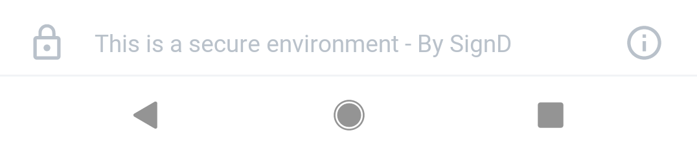
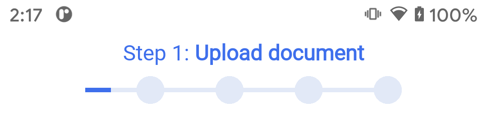
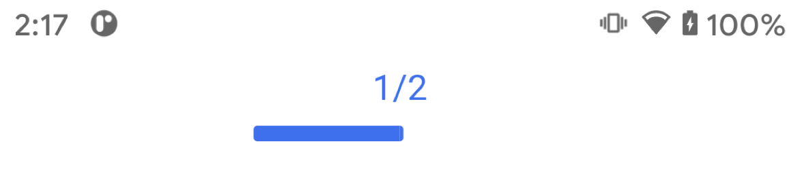
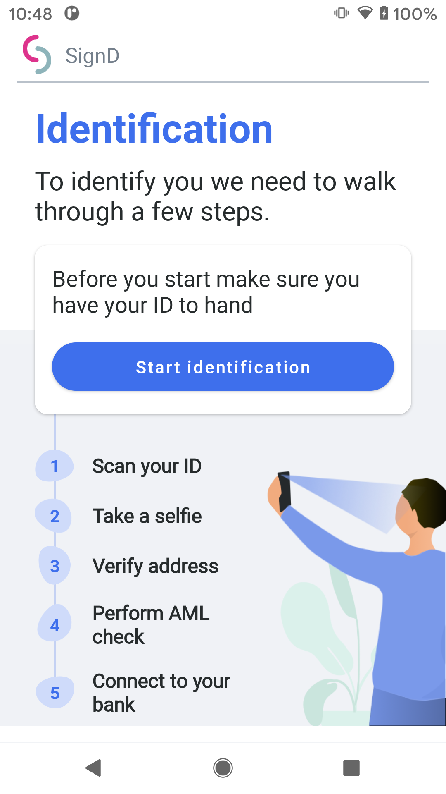
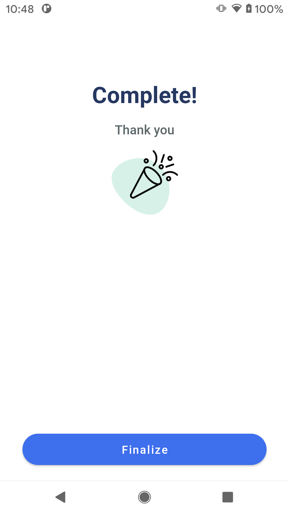

# SignD React Native SDK Integration

## Android and iOS library for user verification.

### How to use the plugin in project.

Add the plugin to code

```npm
npm install signd-reactnative-sdk
```
### Android configuration
1. Include the SignD framework in your project.
	
	We use JitPack to distribute the library.
	Add the following in your project level gradle.
    ```groovy
    allprojects {
        repositories {
            maven { url 'https://raw.githubusercontent.com/Acuant/AndroidSdkMaven/main/maven/' }
            maven { url 'https://raw.githubusercontent.com/iProov/android/master/maven/' }
            maven { url 'https://anylinesdk.blob.core.windows.net/maven/'}

            maven {
                url "https://jitpack.io"
                credentials { username authToken }
            }
            maven { url "https://maven.regulaforensics.com/RegulaDocumentReader" }
            jcenter()
        }
    }
    ```

    To get **authToken** you must:
    - Send SignD your Github account username (the one you use in your company). We will give your account access to the library. 
    - Connect your Github account with JitPack. 
    - Open **gradle.properties** file and put your JitPack access token there.
        
    ```groovy
    authToken=jp_xxxxxxxxxxxxxxxxxxxxxxxxxx
    ``` 
    Then, Gradle should be able to fetch SignD library for you.

2. Add the following dependency in your app level gradle.
    ```groovy
   implementation project(':signd-reactnative-sdk')
    ```

3. In android/variables.gradle file change versions:
    ```
	compileSdkVersion = 31
	targetSdkVersion = 31
    ```
4. In android/app/src/main/AndroidManifest add in "*<application*":
    ```
    android:usesCleartextTraffic="true"
    android:launchMode="singleTask"
    ```
5. In android/app/src/main/AndroidManifest add in "*<activity*":
    ```
    android:exported="true"
    ```
6. As SignD uses [Trusted Web Activity](https://developers.google.com/web/updates/2019/02/using-twa "Trusted Web Activity") to display web content to the user, you also have to add the following string resource. You can skip this step if you don't want the web content to appear fullscreen.

    ```xml
    <string name="assetStatements" translatable="false">"""
        [{
                "relation": ["delegate_permission/common.handle_all_urls"],
                "target": {
                    "namespace": "web",
                    "site": "https://demo.signd.io" <!--  Use the url you received from us -->
                }
            }]
        """
    </string>
    ```
  
7. As part of the SignD Web SDK integration, you will be asked to provide SHA-256 fingerprint; you can extract this fingerprint from your keystore file using **keytool**.
	
    ```bash
    keytool -list -v -keystore ./mykeystore.ks -alias test -storepass password -keypass password
    ```  
    ```
    Certificate fingerprints:
                MD5:  F3:99:83:9B:6B:AC:7A:F0:B3:1E:BD:49:66:DA:81:47
                SHA1: 61:40:28:E8:B8:C6:D5:2E:F7:FF:97:3B:33:FC:CD:04:7E:85:83:61
                SHA256: 48:A9:3F:87:7C:D0:32:0C:3A:80:F3:CB:65:DE:FF:02:77:42:79:CE:64:CA:3F:2B:1C:CD:0E:39:E1:D4:D5:CE
    ```
        
        
    For example, if you want to test [TWA](https://developers.google.com/web/updates/2019/02/using-twa "Trusted Web Activity") in your debug build, use:
        
    ```bash
    keytool -list -v -keystore .android/debug.keystore -alias androiddebugkey -storepass android -keypass android | egrep --color -E SHA256
    ```	
    Copy your SHA256 key and give it to the backend team to integrate under ```/.well-known/assetlinks```

### iOS configuration

1. Add cocoapods to your project /ios/Podfile
    ```pod
    pod 'signd-reactnative-sdk', :path => '../node_modules/signd-reactnative-sdk'
    ```
2. Merge **Localizable.strings** files from */resources/*. with yours **Localizable.strings** files.
3. Add NSCameraUsageDescription to your info.plist.
4. Add strip-unused-architectures-from-target.sh from ios/Resources/ to "Run Script Phase" in your target’s "Build Phases" (optional but recommended)

## How to use the plugin in project
1. Initialize the plugin and pass configuration attributes

    ```typescript
    await SigndModule.initialize({
        scheme: 'signd',
        host: 'session',
        apiUrl: 'https://api.integration.signd.io',
    });
    ```		

2. Start the verification process.
    Do a *POST* request to generate session token.

    ```bash
    curl -d '{"login":"value1", "token":"value2"}' -H "Content-Type: application/json" -X POST API_BASE_URL/internal/handshake
    ```

    Build *uri* using received session token.

    ```typescript
    const { result, sessionToken }: SigndResult = await SigndModule.start(
        token
    );
    switch (result) {
        case VerificationResult.ProcessCancelled: {
        break;
        }
        case VerificationResult.ProcessFailed: {
        break;
        }
        case VerificationResult.ProcessInProgress: {
        break;
        }
        case VerificationResult.ProcessFinished: {
        break;
        }
    }

    console.log('Verification process finished; sessionToken: ' + sessionToken);
    console.log('Result: ' + result);
    Alert.alert('SignD SDK', 'Verification process finished: ' + result);
    ```
# Deep Links configuration
Follow the official guidelines how to add deep link support to your application

Listen for url open events for the app, and if the url is valid, launch the SignD SDK. Remember to initialize the SDK first.

Check out the example project to see how it's done in react.

## Android
Open the manifest and add the <intent-filter> to your MainActivity.

    <intent-filter>
        <action android:name="android.intent.action.VIEW" />

        <category android:name="android.intent.category.DEFAULT" />
        <category android:name="android.intent.category.BROWSABLE" />

        <data
            android:host="signd_host"
            android:scheme="signd_scheme" />
    </intent-filter>

## iOS
Open info.plist and add this lines:

    <key>CFBundleURLTypes</key>
    <array>
        <dict>
            <key>CFBundleURLName</key>
            <string>com.getcapacitor.capacitor</string>
            <key>CFBundleURLSchemes</key>
            <array>
                <string>mycustomscheme</string>
            </array>
        </dict>
    </array>


### Alternatively, while developing you can use adb to simulate deep linking
If you want to play with deep linking you can use adb to open your activity.

Android:
```bash 
adb shell am start -a android.intent.action.VIEW -d "yourscheme://yourhost?sessionToken=your_session_token"your.package.name/id.signd.core.feature.start.SigndActivity
```

iOS:
```bash 
TBD
```

## Customization
**The following methods should be called from the Application class of you app.**

Tweak the UI by changing the following flags:
```typescript
await SigndPlugin.initialize({
    scheme: "signdintegration",
    host: "session",
    apiUrl: "https://api.integration.signd.io",
    showLastScreen: false,
    showFooter: false,
    showBackButton: true,
    progressBarStyle: ProgressBarStyle.Linear,
    buttonImage: "Camera", // iOS only
    actionButtonStyle: ActionButtonStyle.Rounded, // iOS only
    regularFontFileName: "Roboto-Regular.ttf", // iOS only
    boldFontFileName: "Roboto-Bold.ttf", // iOS only
    scanExampleAnimationFileName: "scan_intro.mp4", // iOS only
    doneAnimationFileName: "outro.mp4", // iOS only
    primaryColor: "#E61414", // iOS only
    secondaryColor: "#FFFFFF", // iOS only
    textPrimary: "#1D1D1B", // iOS only
    textSecondary: "#1D1D1B", // iOS only
    textHint: "#535C5F", // iOS only
    primaryBackgroundColor: "#EDEBE2", // iOS only
    secondaryBackgroundColor: "#EDEBE2" // iOS only
})
```
| Property  | Parameter | Description 			|
| ------------- | ------------- | ------------- |
| **showLastScreen** | boolean | Hide last screen with thank you image/animation |
| **showFooter** | boolean | Hide bottom footer with signd logo |
| **showBackButton** | boolean | Enable top left back button |
| **progressBarStyle** | ProgressBarStyle: .Linear .Default | Choose top progressbar style |
| **buttonImage** | string | Name of image added to your iOS project (Assets folder). Image is located in main button (default it's white image of camera) |
| **actionButtonStyle** | ActionButtonStyle: .round .rounded | Choose style of action buttons corners |
| **regularFontFileName** | string | Regular font file name |
| **boldFontFileName** | string | Bold font file name |
| **scanExampleAnimationFileName** | string | Animation displayed as scan id example |
| **doneAnimationFileName** | string | Animation displayed on last screen |
| **primaryColor** | string (hex) | Interface accent color |
| **secondaryColor** | string (hex) | Interface second accent color |
| **textPrimary** | string (hex) | Text color |
| **textSecondary** | string (hex) | Text color |
| **primaryBackgroundColor** | string (hex) | Background color |
| **textHsecondaryBackgroundColor** | string (hex) | Background color |

For custom Font and MP4 files you must add them to iOS project and assign to proper Target.

Some flags only work on iOS. To have the same appearance, refer to the customization guide on Android, [here](https://github.com/signd-identity/signd-android-sdk/blob/master/README.md#customization).

### Customization scenarious
If you want to hide the footer



call
```typescript
await SigndModule.initialize({
    scheme: 'signd',
    host: 'session',
    apiUrl: 'https://api.dev.signd.io',
    showFooter: false
});
```


If you want to change the progress bar style

from 



to




call
```typescript
await SigndModule.initialize({
    scheme: 'signd',
    host: 'session',
    apiUrl: 'https://api.dev.signd.io',
    progressBarStyle: ProgressBarStyle.Linear,
});
```


If you want to show back and close button in the progress bar area


call
```typescript
await SigndModule.initialize({
    scheme: 'signd',
    host: 'session',
    apiUrl: 'https://api.dev.signd.io',
    showCloseButton: true,
    showBackButton: true,
});
```

If you want to skip the start screen



call
```typescript
await SigndModule.initialize({
    scheme: 'signd',
    host: 'session',
    apiUrl: 'https://api.dev.signd.io',
    showStartScreen: false,
});
```


If you want to skip the last screen, and notify the user about the result yourself



call
```typescript
await SigndModule.initialize({
    scheme: 'signd',
    host: 'session',
    apiUrl: 'https://api.dev.signd.io',
    showLastScreen: false,
});
```


### Android only
Other than that, SignD Android SDK provides two ways of customization:

#### By overwriting styles and resources from the SDK.
	This method allows for more customization than the second one, but requires more meticulousness.
	
	You can overwrite the following:
	
* strings in [strings.xml](resources/strings.xml) file

	All strings can be overriden by your app's strings.xml file.

	
* colors in [colors.xml](resources/colors.xml) file
	
	
```xml
<?xml version="1.0" encoding="utf-8"?>
<resources>
    <color name="signd_colorAccent">#3E6FEC</color>
    <color name="signd_colorTextPrimary">#272C2D</color>
    <color name="signd_colorTextGray">#747f8B</color>
    <color name="signd_background">@color/signd_white</color>
    <color name="signd_colorEdgeEffect">@color/signd_colorAccent</color>

</resources>
```

* styles in [text_styles.xml](resources/text_styles.xml) file
	
```xml
<?xml version="1.0" encoding="utf-8"?>
<resources>

    <style name="H1" parent="TextAppearance.AppCompat">
        <item name="android:textColor">@color/signd_colorAccent</item>
        <item name="android:fontFamily">@font/roboto_bold</item>
        <item name="android:textSize">32sp</item>
    </style>

    <style name="H2" parent="TextAppearance.AppCompat">
        <item name="android:textColor">@color/signd_darkBlue</item>
        <item name="android:fontFamily">@font/roboto_bold</item>
        <item name="android:textSize">28sp</item>
        <item name="android:gravity">center_horizontal</item>
    </style>

	<!--    And others   -->
</resources>
```

* button styles

declare the your own styles in app's **styles.xml** file with the following names.

```xml

<style name="Signd_Button_Primary" parent="Widget.MaterialComponents.Button">
	TODO
</style>

<!--  Secondary action button  -->
<style name="Signd_Button_Secondary" parent="Widget.MaterialComponents.Button.UnelevatedButton">
	TODO        
</style>


```

* **Fonts**

SDK uses `roboto_bold.ttf`, `roboto_medium.ttf`, and `roboto_regular.ttf` fonts. If you put a font in app's **font** directory, with the same name, it will overwrite the SDK's font..


#### Via backend. Be sure to configure the backend to provide valid values first, before SDK fetches ui settings.
	
```
{{API_BASE_URL}}internal/ui-setting/token/:sessionToken\
```

Currently only primaryColor and logoURL fields are supported. We will issue more customization options in the future.

```json
{
	"primaryColor": "color in hexadecimal format",
	"logoURL": "url of an image"
}
```

Keep in mind that if you mix two methods above, attributes coming from the backend have higher priority.

# Error Handling
SignD SDK display errors to the users as an alert. 
Errors that are displayed in the process cover all errors that users can experience. 
Scanning process enable user to repeat some action again, if an error occurred in the process.
