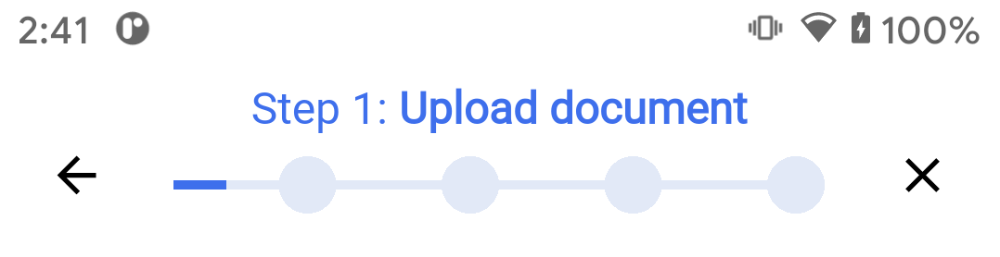

# SignD React Native SDK Integration

## Android library for user verification.

### Android
How to integrate SignD SDK.

1. Include the SignD framework in your project.
	
	We use JitPack to distribute the library.
	Add the following in your project level gradle.
```groovy
allprojects {
    repositories {
        maven { url 'https://raw.githubusercontent.com/Acuant/AndroidSdkMaven/main/maven/' }
        maven { url 'https://raw.githubusercontent.com/iProov/android/master/maven/' }
        maven { url 'https://anylinesdk.blob.core.windows.net/maven/'}

        maven {
            url "https://jitpack.io"
            credentials { username authToken }
        }
	maven { url "https://maven.regulaforensics.com/RegulaDocumentReader" }
    }
}
```
Add the following dependency in your app level gradle.
```groovy
def signdSdkVersion = "0.14.8"

// Core part of the library.
implementation "com.github.signd-identity.signd-android:core:$signdSdkVersion"
// If you want to use OnlineScanId plugin
implementation "com.github.signd-identity.signd-android:scanid:$signdSdkVersion"
// If you want to use OfflineScanId plugin
implementation "com.github.signd-identity.signd-android:offlinescanid:$signdSdkVersion"
```

To get **authToken** you must:
- Send SignD your Github account username (the one you use in your company). We will give your account access to the library. 
- Connect your Github account with JitPack. 
- Open **gradle.properties** file and put your JitPack access token there.
	
```groovy
authToken=jp_xxxxxxxxxxxxxxxxxxxxxxxxxx
``` 
Then, Gradle should be able to fetch SignD library for you.

2. Add a **scheme** and a **host** string resources:

```xml
    <string name="signd_config_scheme" translatable="false">yourScheme</string>
    <string name="signd_config_host" translatable="false">session</string>
```

3. As SignD uses [Trusted Web Activity](https://developers.google.com/web/updates/2019/02/using-twa "Trusted Web Activity") to display web content to the user, you also have to add the following string resource. You can skip this step if you don't want the web content to appear fullscreen.

```xml
<string name="assetStatements" translatable="false">"""
        [{
                "relation": ["delegate_permission/common.handle_all_urls"],
                "target": {
                    "namespace": "web",
                    "site": "https://demo.signd.io" <!--  Use the url you received from us -->
                }
            }]
        """
</string>
```
  
As part of the SignD Web SDK integration, you will be asked to provide SHA-256 fingerprint; you can extract this fingerprint from your keystore file using **keytool**.
	
```bash
keytool -list -v -keystore ./mykeystore.ks -alias test -storepass password -keypass password
```  
```
Certificate fingerprints:
	 		MD5:  F3:99:83:9B:6B:AC:7A:F0:B3:1E:BD:49:66:DA:81:47
	 		SHA1: 61:40:28:E8:B8:C6:D5:2E:F7:FF:97:3B:33:FC:CD:04:7E:85:83:61
	 		SHA256: 48:A9:3F:87:7C:D0:32:0C:3A:80:F3:CB:65:DE:FF:02:77:42:79:CE:64:CA:3F:2B:1C:CD:0E:39:E1:D4:D5:CE
```
	 
	 
For example, if you want to test [TWA](https://developers.google.com/web/updates/2019/02/using-twa "Trusted Web Activity") in your debug build, use:
	
```bash
keytool -list -v -keystore .android/debug.keystore -alias androiddebugkey -storepass android -keypass android | egrep --color -E SHA256
```	
Copy your SHA256 key and give it to the backend team to integrate under ```/.well-known/assetlinks```

5. Initialize framework in the Application class. This way the framework will know what scheme and what url to use.

```kotlin
class DemoApplication : Application() {
    override fun onCreate() {
            super.onCreate()
            Signd.setScheme(yourScheme)
                    .setHost(yourHost)
                    .setApiUrl(yourApiUrl)
                    .addPlugins(ScanIdPlugin, /*OfflineScanIdPlugin*/)
    }
}
```		

## How to start verification process

### Generate session token
Do a *POST* request to generate session token.

```bash
curl -d '{"login":"value1", "token":"value2"}' -H "Content-Type: application/json" -X POST API_BASE_URL/internal/handshake
```

Build *uri* using received session token.

```kotlin
    val uri = Uri.Builder()
        .scheme(yourScheme) // required
        .authority(yourHost) // optional, defaults to 'session'
        .appendQueryParameter("sessionToken", "your session token")
        .build()
```
	
### You can start verification process in two ways:
* Start verification directly from code. Pass generated *uri* when launching **SigndActivity**.

```kotlin
val intent = SigndActivity.createLaunchIntent(context, uri)
startActivityForResult(intent, REQUEST_CODE)
```
  
* Start verification by scanning QR code
	You can transform *uri* into a deep linking QR code and scan it using your phone. This will open **SigndActivity** automatically [(Deep link)](https://developer.android.com/training/app-links/deep-linking "Deep Link").

### Alternatively, while developing you can use adb to simulate deep linking
If you want to play with deep linking you can use adb to open your activity.
	
```bash 
adb shell am start -a android.intent.action.VIEW -d "yourscheme://yourhost?sessionToken=your_session_token"your.package.name/id.signd.core.feature.start.SigndActivity
```	

### How to be notified after finished verification

SDK will notify you in one of two ways, depending on the way you started verification process.

* If you started **SigndActivity** using **startaActivityForResult** method, override **onActivityResult** method to receive the results back.

```kotlin
override fun onActivityResult(requestCode: Int, resultCode: Int, data: Intent?) {
		super.onActivityResult(requestCode, resultCode, data)
		if (requestCode == REQUEST_CODE) {
			when (resultCode) {
				Activity.RESULT_CANCELED -> {
					// Something bad happened and Android framework canceled activity
				}
				Activity.RESULT_OK -> {
					when (val result: VerificationResult = data?.getSerializableExtra(SigndActivity.VERIFICATION_RESULT) as VerificationResult) {
						is ProcessCanceled -> TODO()
						is ProcessFailed -> TODO()
						is ProcessFinished -> fetchResults(result.sessionToken)
						is ProcessInProgress -> TODO()
					}
				}
				else -> {
					// Unknown result
				}
			}
		}
	}
```

* If the verification was started by scanning QR code, you must ensure you registered a listener (**VerificationFinishedListener**), when initializing SignD framework inside the Application class.

```kotlin
Signd.setVerificationFinishedListener(this)
```


## Customization
**The following methods should be called from the Application class of you app.**

If you want to hide the footer


call
```kotlin
Signd.withUiSettings { showFooter = false }
```


If you want to change the progress bar style

from to


call
```kotlin
Signd.withUiSettings { progressBarStyle = ProgressBarStyle.Linear }
```


If you want to show back and close button in the progress bar area



call
```kotlin
    Signd.withUiSettings {
            showCloseButton = true
            showBackButton = true
        }
```

If you want to skip the start screen


call
```kotlin
    Signd.withUiSettings {
            showStartScreen = false
        }
```


If you want to skip the last screen, and notify the user about the result yourself


call
```kotlin
    Signd.withUiSettings {
            showLastScreen = false
        }
```


### Other than that, SignD Android SDK provides two ways of customization:

#### By overwriting styles and resources from the SDK.
	This method allows for more customization than the second one, but requires more meticulousness.
	
	You can overwrite the following:
	
* strings in [strings.xml](resources/strings.xml) file

	All strings can be overriden by your app's strings.xml file.

	
* colors in [colors.xml](resources/colors.xml) file
	
	
```xml
<?xml version="1.0" encoding="utf-8"?>
<resources>
    <color name="signd_colorAccent">#3E6FEC</color>
    <color name="signd_colorTextPrimary">#272C2D</color>
    <color name="signd_colorTextGray">#747f8B</color>
    <color name="signd_background">@color/signd_white</color>
    <color name="signd_colorEdgeEffect">@color/signd_colorAccent</color>

</resources>
```

* styles in [text_styles.xml](resources/text_styles.xml) file
	
```xml
<?xml version="1.0" encoding="utf-8"?>
<resources>

    <style name="H1" parent="TextAppearance.AppCompat">
        <item name="android:textColor">@color/signd_colorAccent</item>
        <item name="android:fontFamily">@font/roboto_bold</item>
        <item name="android:textSize">32sp</item>
    </style>

    <style name="H2" parent="TextAppearance.AppCompat">
        <item name="android:textColor">@color/signd_darkBlue</item>
        <item name="android:fontFamily">@font/roboto_bold</item>
        <item name="android:textSize">28sp</item>
        <item name="android:gravity">center_horizontal</item>
    </style>

	<!--    And others   -->
</resources>
```

* button styles

declare the your own styles in app's **styles.xml** file with the following names.

```xml

<style name="Signd_Button_Primary" parent="Widget.MaterialComponents.Button">
	TODO
</style>

<!--  Secondary action button  -->
<style name="Signd_Button_Secondary" parent="Widget.MaterialComponents.Button.UnelevatedButton">
	TODO        
</style>


```

* **Fonts**

SDK uses `roboto_bold.ttf`, `roboto_medium.ttf`, and `roboto_regular.ttf` fonts. If you put a font in app's **font** directory, with the same name, it will overwrite the SDK's font..


#### Via backend. Be sure to configure the backend to provide valid values first, before SDK fetches ui settings.
	
```
{{API_BASE_URL}}internal/ui-setting/token/:sessionToken\
```

Currently only primaryColor and logoURL fields are supported. We will issue more customization options in the future.

```json
{
	"primaryColor": "color in hexadecimal format",
	"logoURL": "url of an image"
}
```

Keep in mind that if you mix two methods above, attributes coming from the backend have higher priority.

### How to override the 'how to scan an ID' animation.

Android uses the following asset names for the animations:

```kotlin
DocumentSide.FRONT -> Uri.parse("assets:///signd_animation_ID_front")
DocumentSide.BACK -> Uri.parse("assets:///signd_animation_ID_back")
```

To override the animation, put your video files into the app’s **asset** directory, under the corresponding name.
Notice, how the filename doesn't have an extension. Make sure to remove it from your filename as well. Most video formats are supported.


### How to style the final screen.
If you also want to show an animation on this screen, put a video file named **signd_animation_process_finished** in the app’s **asset** directory.


## Miscellaneous - Tracking events
If you want to keep track of various events in the SDK, you can add your own tracker to receive those events.

```kotlin
abstract class Tracker {
	abstract fun setUserProperty(name: String, value: String)
	abstract fun track(event: Event)
	abstract fun trackCurrentScreen(screenName: String)
}
```

To register a custom tracker, call

```kotlin
EventTracker.addTracker(Tracker)
```

With custom trackers you can push the events to your own server or send them to e.g. Analytics.
